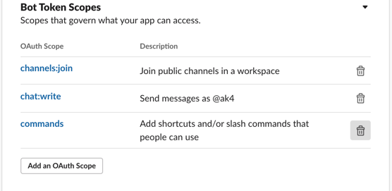
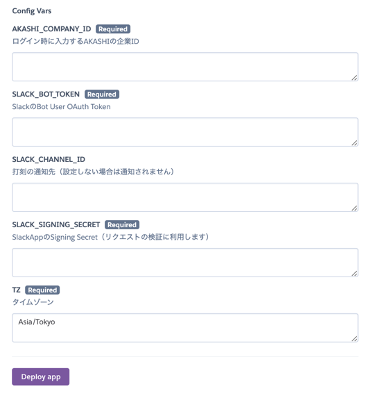
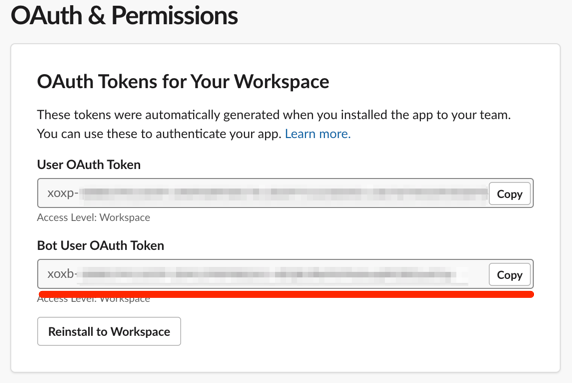
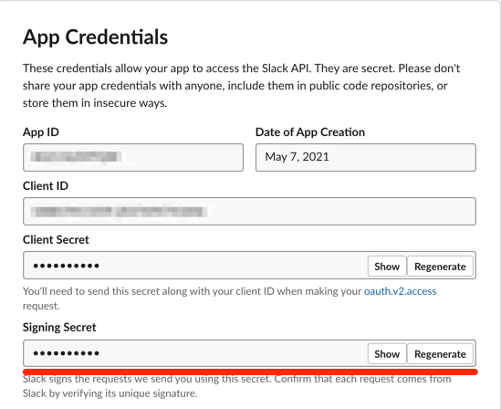
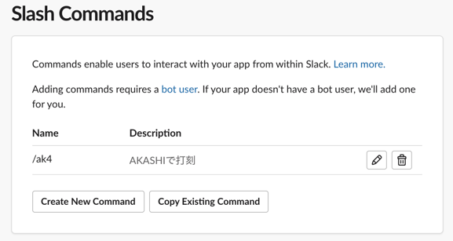
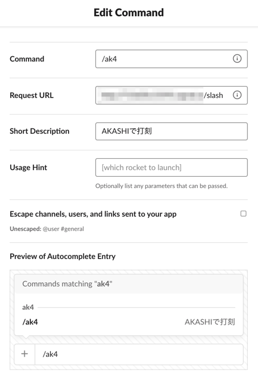
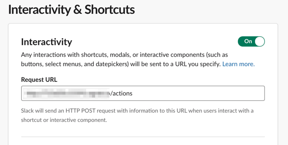

# ak4-slack

## TL;DR

-   Slackからslash commandでAKASHIに打刻するためのAPI

※AKASHIの従業員設定->利用機能設定から[公開APIを「利用する」に設定する](https://akashi.zendesk.com/hc/ja/articles/115004379053-%E5%BE%93%E6%A5%AD%E5%93%A1%E8%A8%AD%E5%AE%9A#change)必要があります

## Demo

## Deploy

### Create SlackApp

-   [SlackAppを作成](https://api.slack.com/apps)する

-   `OAuth & Permissions` -> `Scopes` -> `Bot Token Scopes`から

    -   `chat:write`

    -   `commands`

    -   `channels:join`（打刻の通知先を設定しない場合は不要）
        をそれぞれ追加し、ワークスペースにAppをインストールする
        

### Deploy to Heroku

-   環境変数を追加してデプロイする
    -   `AKASHI_COMPANY_ID`: ログイン時に入力するAKASHIの企業ID
    -   `SLACK_BOT_TOKEN`: 作成したSlackAppのBot User Token

-   `SLACK_CHANNEL_ID`: 打刻を通知したいチャンネル（e.g. 勤怠報告チャンネルなど、設定しない場合通知されません）
-   `SLACK_SIGNING_SECRET`: リクエストの署名に使われる文字列

-   Heroku Schedulerに以下のjobを追加する
    -   `curl https://[your-app-name].herokuapp.com/`（Frequency: Every 10 minutes）
    -   `python refresh_user_tokens.py`（Frequency: Daily at 6:00 PM UTC）

### Set Up SlackApp

-   slash commandsの設定
    -   slash commandを追加してrequest urlを設定する(パスは`/slash`)

-   interactivity
    -   interactivity & shortcutsを設定する（パスは`/actions`）

## Environment Veriables

-   AKASHI_COMPANY_ID
-   SLACK_BOT_TOKEN
-   SLACK_SIGNING_SECRET
-   DATABASE_URL
-   SLACK_CHANNEL_ID(optional)

## Requirements

-   Python3.9+
-   Pipenv

## Development

### Installation

-   `pipenv install --dev`

### Pipenv scripts

-   `pipenv run start`
    run local server

-   `pipenv run sort`
    run isort

-   `pipenv run test-cov`
    run tests

## License

[MIT](LICENSE)
